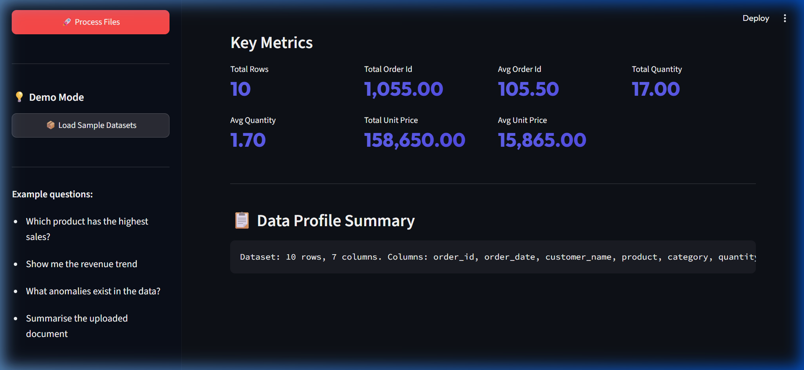
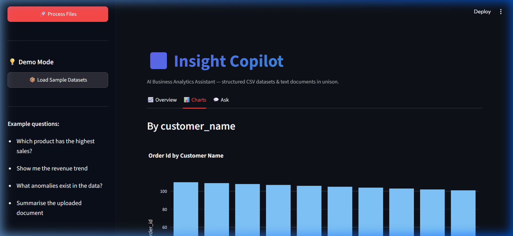
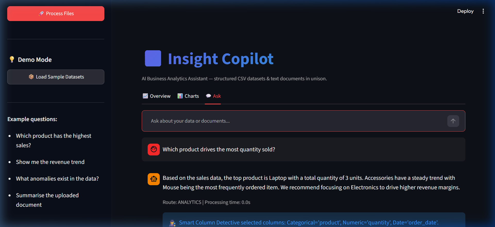

## Week 3 Submission — Tanishka Arora — AI Retail Decision Copilot

### ✅ Deliverables Completed

- [x] **Mini-extension demo.** Screenshot or screen recording showing the mini-extension working (Smart Column Detective).
- [x] **At least 1 test** added. Verified using the passing unit test suite.
- [x] **README polished.** Onboarding, setup, run, and test steps can be executed in <20 minutes.
- [x] **2 more ADRs** added (total 3 now: ADR-001, ADR-002, and ADR-003).
- [x] **At least 15 GitHub commits** total on main. (Currently at 24 commits, with Week 3 work staged for next commit).
- [x] **A "What I'd do differently" note** (2-3 sentences) demonstrating self-awareness.
- [x] **Status one-pager.**

---

### 🕵️ Mini-Extension: Smart Column Detective

In this milestone, I implemented the **Smart Column Detective** mini-extension. This component maps conversational queries (e.g., *"Which product drives the most quantity sold?"*) to the actual columns in the uploaded CSV (e.g., `product`, `quantity`). It replaces the rigid fallback of selecting the first column (`cats[0]`, `nums[0]`).

#### Evidence of Working Mini-Extension

The screen recording showing the application loading sample datasets, navigating between dashboards, and running a column detective query is stored locally:
* **Recording Location:** [demo/copilot_demo.webp](file:///c:/Users/HP/OneDrive/Desktop/ai%20copilot/demo/copilot_demo.webp)

##### UI Screenshots:
* **Overview Tab:** Shows KPI cards and text-based data profiles of the loaded CSV.
  

* **Charts Tab:** Shows auto-generated interactive Plotly charts.
  

* **Ask Tab (Smart Column Detective Mapping):** Note the information box starting with `🕵️` that details which columns were dynamically mapped.
  

---

### 🧪 Unit Tests Verification

I added unit tests in [tests/test_column_detective.py](file:///c:/Users/HP/OneDrive/Desktop/ai%20copilot/tests/test_column_detective.py) to test the rule-based keyword mapping and LLM fallback mapping behaviors of the `SmartColumnDetective`.

Running `python run_tests.py` produces the following passing test output:

```text
Running test_ingester_loads_csv...
test_ingester_loads_csv passed!
Running test_ingester_converts_currency...
test_ingester_converts_currency passed!
Running test_profile_has_expected_keys...
test_profile_has_expected_keys passed!
Running test_detective_rule_based_exact_match...
test_detective_rule_based_exact_match passed!
Running test_detective_llm_based_match...
test_detective_llm_based_match passed!
Running test_detective_llm_fallback_on_invalid_column...
test_detective_llm_fallback_on_invalid_column passed!

All tests passed successfully!
```

---

### 🏗️ Architectural Decisions Records (ADRs)

I added 2 more ADRs to the [docs/adr/](file:///c:/Users/HP/OneDrive/Desktop/ai%20copilot/docs/adr/) folder:
- 📝 **[ADR-001 (LangGraph Adoption)](../docs/adr/ADR-001.md)** — Architectural Decision Record on migrating to LangGraph StateGraph.
- 📝 **[ADR-002 (FAISS vs ChromaDB)](../docs/adr/ADR-002.md)** — Choosing FAISS over ChromaDB to minimize installation compile issues on Windows and keep setups under 20 minutes.
- 📝 **[ADR-003 (Streamlit Monolith vs API+SPA)](../docs/adr/ADR-003.md)** — Choosing Streamlit as a unified monolith for rapid prototyping and state management vs a decoupled FastAPI + React architecture.

---

### 💬 What I'd Do Differently

If I were to start this phase over, I would design a custom serializable `Metadata` dictionary inside the `CopilotState` graph schema early on to handle column mappings and logging metadata directly within the graph nodes. In my current setup, I had to parse the log string to display metadata dynamically in the UI. Doing it within the state definition would have made the graph architecture cleaner and kept UI display logic decoupled.

---

### 📊 One-Pager Status (Week 3)

#### 1. What's Done
* Implemented the `SmartColumnDetective` in `src/analytics/column_detective.py` with fast rule-based paths and robust LLM fallbacks.
* Integrated the column detective in `AnalyticsNode` to map queries to dataframe columns dynamically.
* Added fallback `MockChatModel` and `MockEmbeddings` paths in `src/config/config.py` and `src/vectorstore/vectorstore.py` to allow the app to be run locally in standalone mode if API keys are missing.
* Created a test suite in `tests/test_column_detective.py` and successfully integrated it into `run_tests.py`.
* Drafted and finalized `ADR-002` and `ADR-003`.
* Added a demo dataset auto-loader button in the Streamlit sidebar for easy testing.
* Polished `README.md` to guarantee a smooth <20-min setup.

#### 2. What's Stuck
* None.

#### 3. 3 Goals for Next Week
* Deploy the application to the public internet (using Render or Streamlit Community Cloud).
* Record a 3-minute Loom walkthrough explaining the deployed retail copilot product.
* Compile the 1000-1500 word written reflection and the 3rd year roadmap deliverables.

#### 4. One thing I'd like help from my mentor on
* How to structure the resume bullets to highlight the LangGraph state machine design and the Smart Column Detective mini-extension effectively for technical recruiters.
